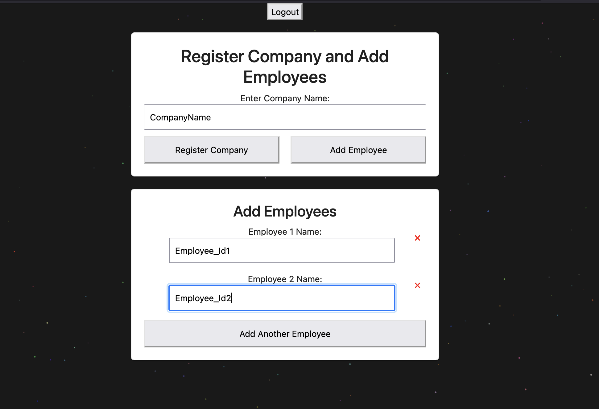

# Remote Work & Mental Health 🌍🧠

## Overview
The **Remote Work & Mental Health** data product aims to gather insights about employee well-being from various organizations. The goal is to identify key parameters affecting individual satisfaction with remote work.

## Features
- **Secure Data Collection**: Aggregate data from different organizations regarding employee satisfaction and mental health is collected.
- **Analytics Dashboard**: Visualize key metrics and trends impacting remote work satisfaction.
- **Actionable Insights**: Identify areas for improvement and make data-driven decisions to enhance employee well-being and how much organization is work from friendly.


## Installation
To set up the project locally, follow these steps:
1. Clone the repository:
   ```bash
   git clone https://github.com/prashant3167/mentalhealth.git
   ```
2. Start the front and backend service
    ```bash
    make all
    ```
   4 Processes will be started with access to all the services
   ```
      UI is available on http://localhost
      UI username: {username} and password: {password}
      Orchestrator is available on http://localhost:3000
      Dashboard is available on http://localhost:3001/public/dashboard/855de8a6-5fd4-4d31-96da-7844bc0ba29e
      Dashboard username: {email} and password: {password}
   ```
   


## DataProcessing and Training from Scratch

Overall feature exploration and decision for feature selection and model building is explained in [EDA.pdf](docs/EDA.pdf)


To retrain and rebuild model follow this steps
1. Remove the present pickle files from resources directory
      ```bash
      make clean_resource
      ```

2. Cleaning and preprocessing the dataset using [config.py](/train_model/config.py), which consist metadata about dataset and what operation need to be perfomed based on its datatype
    ```
    make feature_engineering
    ```
    It will create the proecssed_dataset.csv inside [data](data) directory. With this it will also create the joblib files which will be used in the pipleine.

3. We can now test different parameters like RandomForestClassifier and XGBoostClassifier with their and hyperparameters with different combination with [Weight and bias Sweep framework](https://docs.wandb.ai/guides/sweeps).
With the best configuration and model it will create the model.
      ```bash
      make model_check_and_build
      ```
> **_NOTE:_**  Wandb Secret key is needed here for this, I have kept it in the Makefile for least configuration


## Model File Descriptions ✨

- **`{column_name}_encoder.joblib`**: This file is used for encoding ordinal and categorical features within the dataset.

- **`{column_name}_scaler.joblib`**: This file is utilized for scaling ordinal and numerical datasets. Note that the target dataset will not be scaled, even though it is an ordinal value, to maintain the integrity of the classification process.

- **`{target}_predict.pickle`**: This is the model's pickle file, containing the best configuration for making predictions.


## System Architecture


> Note:
> 1. We are using resources path instead of artifactory which will be moved to weight and bias artifactory
> 2. Our Database is parititioned but it is managed by parquet we need to move to iceberg or some other datalake
> 3. Mailing mechanism is still pending, right now we have workaround.
> Companies can register and create tokens for the employees from the UI as a workaround mentioned in [UI Flow](#ui-flow-for-companies) which can be accessed on http://localhost/login. Username and password will be provided on deployment.

## UI Flow for companies

### New Companies who wants to register

Add Company name and employee Ids



### For creating token for employees


## User_Form

Here we have taken care of minimum hassle for user and at the same time we will have accountability from user through our token system we can visualize how user perception is changing over time

Use case 1. If user tries to access without token, he will get the below view
   

Use case 2. User is having token, then he will give the form view. After this also we have added check, if the token is already used that then it will give back error and not record the feedback. We can add the expiration with the token and also only one token is valid for one user


## Dagster Data Processing and Prediction

Dagster is a modern orchestration platform for data workflows, designed to manage, monitor, and deploy complex data pipelines effectively. It offers a declarative and flexible approach to building pipelines, making it easy to test, maintain, and scale. Dagster focuses on modularity, observability, and developer productivity, with native support for defining data assets, pipeline dependencies, and schedules.
Key Features of Dagster:

  - Data-Aware Pipelines: Dagster pipelines treat data as first-class citizens, allowing you to define inputs and outputs explicitly, making pipelines easier to understand and debug.

  - Modular Architecture: Dagster promotes reusability by allowing you to break down workflows into composable units called "solids" that can be reused across different pipelines.

  - Observability and Monitoring: With Dagster, you get rich metadata, logs, and dashboards for monitoring data pipelines. This enables you to track the flow of data and ensure everything runs smoothly.

  - Scheduling and Triggering: Dagster allows you to schedule pipelines, run backfills, and trigger workflows based on events. It integrates easily with systems like cron and Kubernetes.

  - Seamless Integrations: Dagster integrates well with various data tools such as Pandas, Spark, DBT, and others, providing seamless management of workflows across different tools.

We are running pipeline to collect data on daily basis and and then based on the model and data types we are 
using models to encode and scale the dataset and after this we are selectiting the features for prediction and then using the pickle file to load and predict from the model and writing it in partitioned based on `company` and `created_at`. Overall data processing can be seen in below diagram.


With this it will start the all the process, We need manually start the schdeuler
inside the dagster.
http://localhost:3000/locations/main.py/jobs/mongo_partitioned_job/partitions


Click on all and start the backfill and switch on the job which will run 12:00 A.M. every night.


## Metabase Dashboard

The Metabase Dashboard is an interactive web application built using the DuckDb , designed for visualizing data and providing insights in a highly customizable, user-friendly interface. Metabase is particularly well-suited for building analytical web applications with no need for extensive front-end development experience. It can provide a common interface to access data from multiple sources.

The dashboard has 2 roles:
1. Show the features which are important for `Satisfaction_with_Remote_Work`
2. Show the data related to employee
<!-- > **_NOTE:_** To add company level governance so that no company can see other company employees -->


